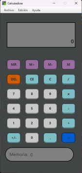
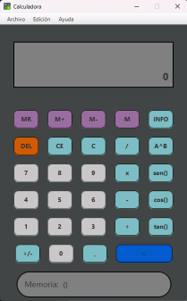
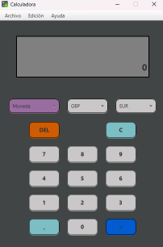
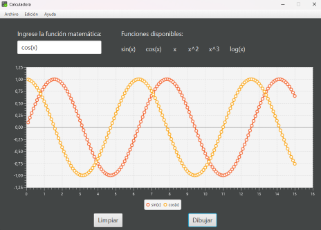

# pedroAC12.github.io
# Proyecto final asignatura Desarrollo de Interfaces

Esta practica consiste en el desarrollo de una Calculadora con multiples funcionalidades

## Calculadora Normal

La práctica consiste en generar una **guía de estilo** (rellenando el documento modelo propuesto) y seguir algunas de las reglas básicas de **usabilidad** vistas, personalizando y reorganizando mediante paneles las ventanas de la aplicación desarrollada previamente:

-   Se deberá hacer un estudio de la **usabilidad** de la aplicación (especialmente la parte de creación de usuarios nuevos), así como justificar el uso de una *paleta de colores* específica y una *fuente tipográfica*. Rellena el documento de la [guía de estilo](Plantilla_guía_de_estilo.docx) adjunta al proyecto.
-   La **barra superior** de las ventanas deberá de ser sustituida por una barra personalizada creada por nosotros, con su misma funcionalidad (excepto por el momento mover la ventana). Nota: usar para ello la propiedad *undecorated* de un JFrame.
-   Se deberán de utilizar *JPanels* sobre la ventana y se recomienda como **layout** el *Free Design* para la ventana superior y el *Null Layout* para el panel principal.

  

## Parte 2

Rediseña la **ventana principal** para que a partir de ahora se le añada contenido y funcionalidades:
- Agrándala y agrégale un gran panel central con un *JTextArea* y otro lateral con los botones. Agrega una barra inferior de estado con funcionalidad. 
- Agrega un menú superior con las opciones de **archivo** y **edición**.
	- El menú **archivo** tendrá la opción de abrir y guardar archivos de tipo texto cuyo contenido se cargará en el *JTextArea* central de la ventana principal.
	- Agrega un **selector de color** a las opciones del menú de edición, cuya función sea cambiar el color de fondo de los *JPanel* y de toda la interfaz.

Mejora el ejercicio anterior permitiendo **mover** todas las ventanas desde su barra superior personalizada.

  

## Parte 3

Busca la forma de generar un **ejecutable** para *Windows_64* usando el fichero **jar** generado de tu proyecto. Agrégale un **icono** propio a tu aplicación.

Crea un **instalador** para tu aplicación usando el programa *installa4j* siguiendo los pasos del siguiente tutorial desde [este enlace.](https://www.raulprietofernandez.net/blog/programacion/como-crear-un-instalador-para-aplicaciones-java-con-install4j)

Opcional: Busca la forma de mejorar el selector de color por defecto utilizado, ya sea en repositorios u otras clases en Internet. Haz lo mismo con el selector de ficheros por defecto.

Opcional: Investiga la forma de integrar el funcionamiento de la Base de Datos de tu aplicación mediante el instalador (evaluable para el proyecto)

  

  
